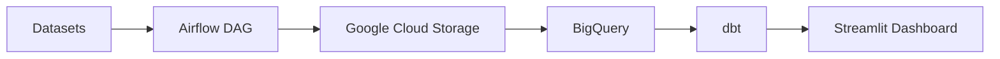

# PhilsPulse: National Economic Ingestion and Analytics Pipeline

This repository tracks delivery of the PhilsPulse capstone project.

Project framing and dataset scope are documented in [docs/project-charter.md](docs/project-charter.md).

Welcome to your new dbt project!

### Using the starter project

Try running the following commands:

- dbt run
- dbt test

### Resources:

- Learn more about dbt [in the docs](https://docs.getdbt.com/docs/introduction)
- Check out [Discourse](https://discourse.getdbt.com/) for commonly asked questions and answers
- Join the [chat](https://community.getdbt.com/) on Slack for live discussions and support
- Find [dbt events](https://events.getdbt.com) near you
- Check out [the blog](https://blog.getdbt.com/) for the latest news on dbt's development and best practices

## Partitioning and Performance

I implemented partitioning by year on the `fct_food_prices` table (partitioned by the `report_month` column) to optimize query costs in BigQuery, following best practices for large-scale analytical warehouses. This ensures efficient scans and lower costs for time-based queries.

## Architecture Diagram

## Batch Ingestion Logic

Although the data is historical, the pipeline is designed as a Batch Ingestion system. Airflow orchestrates monthly batch loads from WFP CSVs to Google Cloud Storage, then into BigQuery. dbt transforms the data for analytics, and Streamlit provides the dashboard. This design supports scalable, repeatable monthly updates as new data arrives.

## How to Run (Reproducibility)

To reproduce the full pipeline end-to-end:

1. **Provision Infrastructure:**
   - `terraform apply` (in the `terraform/` directory) to set up GCP resources.
2. **Start Services:**
   - `docker-compose up` to launch Airflow and supporting services.
3. **Build Data Models:**
   - `dbt build` (in `ph_pulse_dbt/`) to transform and test data in BigQuery.
4. **Launch Dashboard:**
   - `streamlit run app.py` to start the interactive dashboard.

All steps are automated and reproducible for peer review.
