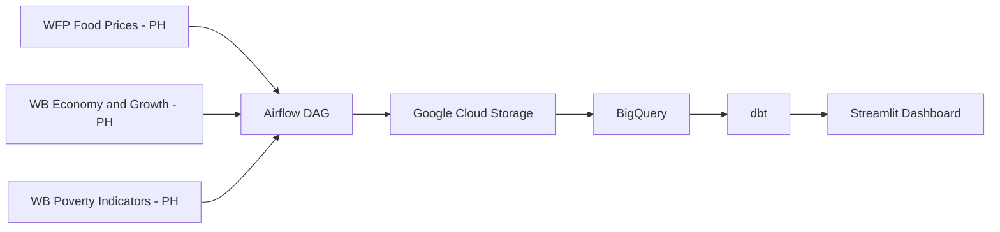

# PhilsPulse: National Economic Ingestion and Analytics Pipeline

This repository tracks delivery of the PhilsPulse capstone project.

Project framing and dataset scope are documented in [docs/project-charter.md](docs/project-charter.md).

## Official Dataset Sources (HDX)

The project uses these three datasets as the official source pages:

1. [WFP Food Prices for Philippines](https://data.humdata.org/dataset/wfp-food-prices-for-philippines)
2. [World Bank Economy and Growth Indicators for Philippines](https://data.humdata.org/dataset/world-bank-economy-and-growth-indicators-for-philippines)
3. [World Bank Poverty Indicators for Philippines](https://data.humdata.org/dataset/world-bank-poverty-indicators-for-philippines)

Note: the Airflow DAG uses direct CSV resource links by default. You can override those links using Airflow Variables if needed.

## Partitioning and Performance

I implemented partitioning by year on the `fct_food_prices` table (partitioned by the `report_month` column) to optimize query costs in BigQuery, following best practices for large-scale analytical warehouses. This ensures efficient scans and lower costs for time-based queries.

## Architecture Diagram



## Batch Ingestion Logic

Although the data is historical, the pipeline is designed as a batch ingestion system. Airflow orchestrates daily runs that fetch CSV snapshots from the three HDX sources, writes raw files to Google Cloud Storage, and loads staging tables in BigQuery. dbt then transforms the data for analytics, and Streamlit provides the dashboard.

## How to Run (Reproducibility)

To make reproduction turnkey the repository includes a small set of helper files:

- `requirements.txt` — Python packages for local development (dashboard + ingestion scripts)
- `airflow-requirements.txt` — optional packages intended for the Airflow container
- `ph_pulse_dbt/profiles.yml.template` — a dbt BigQuery profile template (copy to `~/.dbt/profiles.yml`)
- `.env.example` — example environment variables to copy into `.env` or export in your shell
- `Makefile` — convenience targets: `make infra`, `make up`, `make dbt-run`, `make dashboard`

Prerequisites

- Python 3.10+ and a virtualenv (optional but recommended)
- `gcloud` CLI authenticated to a service account with BigQuery & Storage roles (or use a service account JSON)
- Docker & Docker Compose (for Airflow)

## Airflow Setup Instructions

To run the Airflow DAGs in this project, reviewers must complete the following setup steps:

### 1. Airflow Connections

- **google_cloud_default**:  
   Create a connection in Airflow (Admin → Connections) named `google_cloud_default` of type "Google Cloud".
  - Use a service account key with access to BigQuery and GCS.
  - You can upload the JSON key file directly in the connection or set the `GOOGLE_APPLICATION_CREDENTIALS` environment variable.

### 2. Airflow Variables


PLACEHOLDER NOTE: Replace the placeholder path above with your actual Airflow Variables screenshot path.

Set the following Airflow Variables (Admin → Variables or via CLI):

| Variable Name   | Example Value                  | Description                         |
| --------------- | ------------------------------ | ----------------------------------- |
| ph_bq_project   | your-gcp-project-id            | GCP project for BigQuery            |
| ph_bq_dataset   | ph_economy_staging             | BigQuery dataset                    |
| ph_bucket_name  | ph-economic-pulse-lake-eduardo | GCS bucket for raw data             |
| ph_wfp_url      | (optional override)            | WFP Food Prices CSV resource URL    |
| ph_poverty_url  | (optional override)            | Poverty Indicators CSV resource URL |
| ph_economic_url | (optional override)            | Economy/Growth CSV resource URL     |

Default source pages for reference:

- WFP: https://data.humdata.org/dataset/wfp-food-prices-for-philippines
- Economy/Growth: https://data.humdata.org/dataset/world-bank-economy-and-growth-indicators-for-philippines
- Poverty: https://data.humdata.org/dataset/world-bank-poverty-indicators-for-philippines

**Note:**  
Even though defaults exist in the code, you must set these variables in Airflow for the DAGs to work reliably.

Example CLI commands (run inside the Airflow container):

```bash
docker compose exec airflow-webserver airflow variables set ph_bq_project your-gcp-project-id
docker compose exec airflow-webserver airflow variables set ph_bq_dataset ph_economy_staging
docker compose exec airflow-webserver airflow variables set ph_bucket_name ph-economic-pulse-lake-eduardo
```

### 3. Google Cloud Credentials

- Copy your service account key to `config/google_credentials.json` (do not commit this file).
- Set the environment variable:
  - On Linux/macOS:  
     `export GOOGLE_APPLICATION_CREDENTIALS=config/google_credentials.json`
  - On Windows PowerShell:  
     `$env:GOOGLE_APPLICATION_CREDENTIALS = "config/google_credentials.json"`

- The service account must have permissions for BigQuery and GCS.

### 4. Documentation

- All required variables and connection names are listed above.
- See `config/google_credentials.json.example` for the expected credential file format.

Quickstart (Linux/macOS)

1. Create a Python virtual environment and install dependencies:

```bash
python -m venv .venv
source .venv/bin/activate
pip install -r requirements.txt
```

2. Provide credentials and environment variables (copy the example):

```bash
cp .env.example .env
# edit .env and set GOOGLE_APPLICATION_CREDENTIALS and GCP_PROJECT
export GOOGLE_APPLICATION_CREDENTIALS=/full/path/to/service-account.json
export GCP_PROJECT=your-gcp-project-id
export TF_VAR_project=$GCP_PROJECT
export TF_VAR_region=asia-southeast1
```

3. Set up dbt profiles

Copy the template to your dbt profiles location (default `~/.dbt`):

```bash
mkdir -p ~/.dbt
cp ph_pulse_dbt/profiles.yml.template ~/.dbt/profiles.yml
# Edit ~/.dbt/profiles.yml and confirm the values or rely on the env vars above
```

Alternatively, set `DBT_PROFILES_DIR` to point at `ph_pulse_dbt` and keep the template there.

4. Provision infrastructure (optional):

```bash
cd terraform
terraform init
terraform plan
terraform apply -auto-approve
```


5. Start services (Airflow):

```bash
docker compose up -d
# visit http://localhost:8080 to view Airflow and trigger DAGs
```


6. Configure Airflow variables

The DAGs read a few configuration values from Airflow Variables so you can run the pipeline without editing code. Set these in the Airflow UI (`Admin -> Variables`) or via the CLI inside the Airflow webserver container:

```bash
# inside the workspace
docker compose exec airflow-webserver airflow variables set ph_bq_project your-gcp-project-id
docker compose exec airflow-webserver airflow variables set ph_bq_dataset ph_economy_staging
docker compose exec airflow-webserver airflow variables set ph_bucket_name ph-economic-pulse-lake-eduardo
```

Use the same project/dataset names you provisioned with Terraform (or update the Terraform variables and re-run `terraform apply`).


7. Run dbt (local development using seeds):

```bash
cd ph_pulse_dbt
# seed sample data for local runs and then build
dbt seed --profiles-dir $(DBT_PROFILES_DIR)
dbt build --profiles-dir $(DBT_PROFILES_DIR) --vars "use_seed: true"
```


8. Launch the Streamlit dashboard:

```bash
streamlit run app.py
```


Make shortcuts

You can use the included Makefile (if `make` is available on your system):

```bash
make infra           # terraform init/plan/apply
make up              # docker compose up -d
make dbt-run         # dbt build (uses DBT_PROFILES_DIR if set)
make dashboard       # run streamlit
```

Notes for Windows / PowerShell

- Activate the venv with:

```powershell
.\.venv\Scripts\Activate.ps1
pip install -r requirements.txt
# set environment variables using $env:NAME = 'value' or use a .env file loader
```

Airflow container

If you want packages installed into the Airflow container, you can mount or copy `airflow-requirements.txt` into the image build process or pass it to the official Airflow image during initialization. See the Airflow image docs for details.

If you want me to automatically add a simple Dockerfile or update `docker-compose.yaml` to install `airflow-requirements.txt` inside the Airflow service, tell me and I'll add that change.

## Submission Placeholders (Fill These Before Final Submission)

Screenshot filename guide: see `docs/screenshots/README.md`.

- PLACEHOLDER: `<your-gcp-project-id>`
- PLACEHOLDER: `<your-bigquery-dataset-id>`
- PLACEHOLDER: `<your-gcs-bucket-name>`
- PLACEHOLDER: Add screenshot path for Airflow DAG graph view.
- PLACEHOLDER: Add screenshot path for successful Airflow task logs.
- PLACEHOLDER: Add screenshot path for BigQuery table partitioning and clustering metadata.
- PLACEHOLDER: Add screenshot path for Streamlit dashboard tile 1 (temporal trend).
- PLACEHOLDER: Add screenshot path for Streamlit dashboard tile 2 (categorical/regional).

## BigQuery Optimization Evidence Placement

Insert your BigQuery partition/clustering proof screenshot here:


