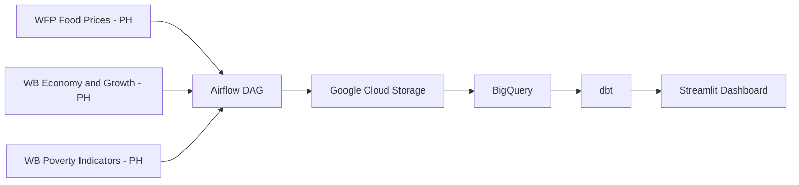
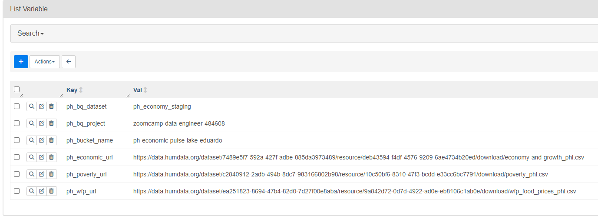
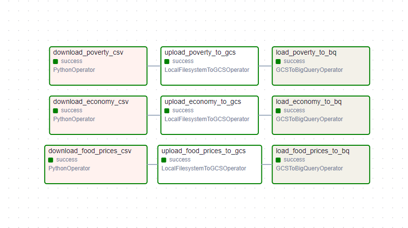
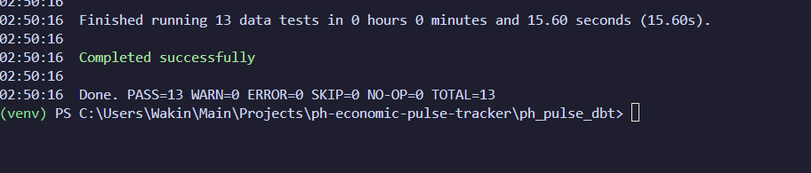
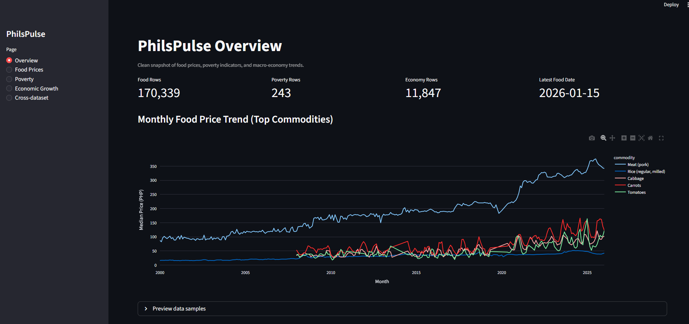
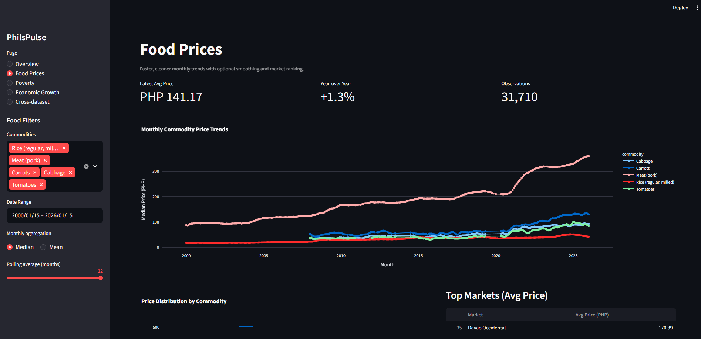
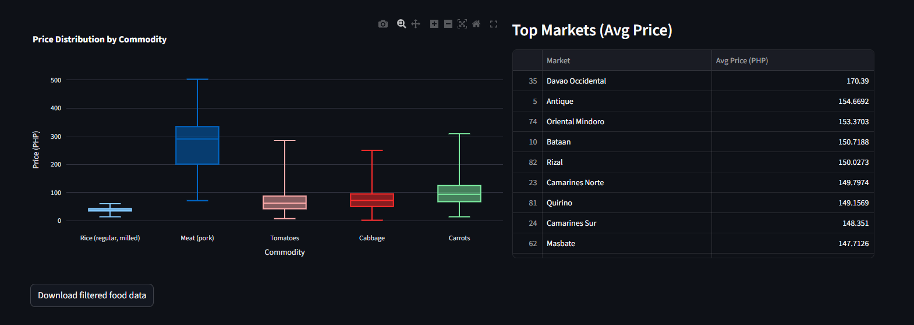
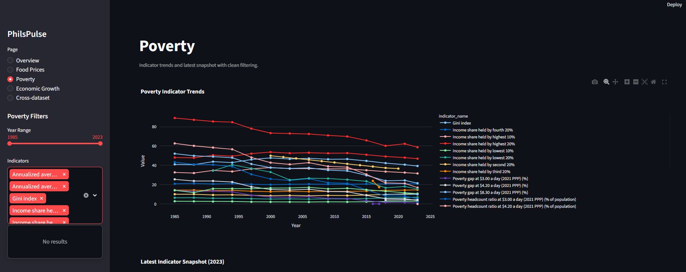
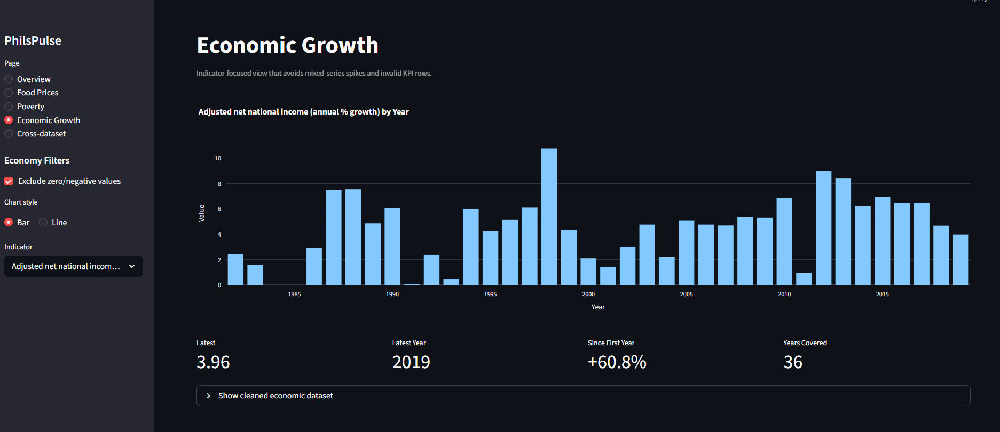
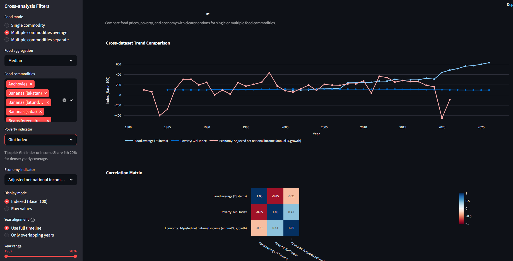

# PhilsPulse: National Economic Ingestion and Analytics Pipeline

This repository tracks delivery of the PhilsPulse capstone project.

Project framing and dataset scope are documented in [docs/project-charter.md](docs/project-charter.md).

## Official Dataset Sources (HDX)

The project uses these three datasets as the official source pages:

1. [WFP Food Prices for Philippines](https://data.humdata.org/dataset/wfp-food-prices-for-philippines)
2. [World Bank Economy and Growth Indicators for Philippines](https://data.humdata.org/dataset/world-bank-economy-and-growth-indicators-for-philippines)
3. [World Bank Poverty Indicators for Philippines](https://data.humdata.org/dataset/world-bank-poverty-indicators-for-philippines)

Note: the Airflow DAG uses direct CSV resource links by default. You can override those links using Airflow Variables if needed.

## Partitioning and Performance

I implemented partitioning by year on the `fct_food_prices` table (partitioned by the `report_month` column) to optimize query costs in BigQuery, following best practices for large-scale analytical warehouses. This ensures efficient scans and lower costs for time-based queries.

## Architecture Diagram



## Batch Ingestion Logic

Although the data is historical, the pipeline is designed as a batch ingestion system. Airflow orchestrates daily runs that fetch CSV snapshots from the three HDX sources, writes raw files to Google Cloud Storage, and loads staging tables in BigQuery. dbt then transforms the data for analytics, and Streamlit provides the dashboard.

## Detailed Setup and Runbook (Clone -> Terraform -> Docker -> DAG)

### 0. Clone the repository

```bash
git clone https://github.com/eduardodfran/ph-economic-pulse-tracker.git
cd ph-economic-pulse-tracker
```

### 1. Prerequisites

Install and verify:

- Python 3.10+
- Docker Desktop (with Docker Compose)
- Terraform 1.5+
- Google Cloud SDK (`gcloud`) and BigQuery CLI (`bq`)

Quick checks:

```bash
python --version
docker --version
docker compose version
terraform --version
gcloud --version
bq version
```

### 2. Create local Python environment

Linux/macOS:

```bash
python -m venv .venv
source .venv/bin/activate
pip install -r requirements.txt
```

Windows PowerShell:

```powershell
python -m venv .venv
.\.venv\Scripts\Activate.ps1
pip install -r requirements.txt
```

### 3. Configure GCP authentication and local env vars

1. Create a service account with BigQuery + GCS permissions (minimum: BigQuery Data Editor, BigQuery Job User, Storage Admin).
2. Download the service account key JSON.
3. Save it locally as `config/google_credentials.json` (do not commit this file).
4. Copy env template and set values.

Linux/macOS:

```bash
cp .env.example .env
export GOOGLE_APPLICATION_CREDENTIALS="$(pwd)/config/google_credentials.json"
export GCP_PROJECT="your-gcp-project-id"
export TF_VAR_project="$GCP_PROJECT"
export TF_VAR_region="asia-southeast1"
```

Windows PowerShell:

```powershell
Copy-Item .env.example .env
$env:GOOGLE_APPLICATION_CREDENTIALS = "$PWD\config\google_credentials.json"
$env:GCP_PROJECT = "your-gcp-project-id"
$env:TF_VAR_project = $env:GCP_PROJECT
$env:TF_VAR_region = "asia-southeast1"
```

Optional: validate auth before provisioning:

```bash
gcloud auth activate-service-account --key-file config/google_credentials.json
gcloud config set project your-gcp-project-id
gcloud auth list
```

### 4. Provision infrastructure with Terraform

1. Create Terraform variable file.
2. Plan and apply.
3. Capture outputs for Airflow variables.

Linux/macOS:

```bash
cd terraform
cp terraform.tfvars.example terraform.tfvars
# edit terraform.tfvars and set project and unique bucket_name
terraform init
terraform validate
terraform plan -out tfplan
terraform apply tfplan
terraform output
cd ..
```

Windows PowerShell:

```powershell
Set-Location terraform
Copy-Item terraform.tfvars.example terraform.tfvars
# edit terraform.tfvars and set project and unique bucket_name
terraform init
terraform validate
terraform plan -out tfplan
terraform apply tfplan
terraform output
Set-Location ..
```

Expected resources:

- 1 GCS bucket (data lake)
- 1 BigQuery dataset (staging)

### 5. Start Airflow in Docker

Initialize Airflow metadata DB and admin user, then start services:

```bash
docker compose up airflow-init
docker compose up -d
docker compose ps
```

Airflow UI:

- URL: http://localhost:8080
- Username: `airflow`
- Password: `airflow`

### 6. Configure Airflow connection and variables

The DAG expects:

- Connection: `google_cloud_default`
- Variables: `ph_bq_project`, `ph_bq_dataset`, `ph_bucket_name`

You can configure these using either the Airflow web UI (recommended for most users) or the CLI.

#### Using the Airflow Web UI (Recommended)

1. Open Airflow at [http://localhost:8080](http://localhost:8080) (default: username `airflow`, password `airflow`).
2. Go to **Admin → Connections**.

- Click **+ (Add a new record)**.
- Set **Conn Id** to `google_cloud_default`.
- Set **Conn Type** to `Google Cloud`.
- In **Extra**, paste:
  ```
  {"key_path":"/config/google_credentials.json","project":"your-gcp-project-id"}
  ```
  (Adjust the `key_path` if your Docker mount is different. By default, `config` is mounted to `/config`.)

3. Go to **Admin → Variables**.

- Add the following variables:
  - `ph_bq_project`: your GCP project ID
  - `ph_bq_dataset`: your BigQuery dataset (e.g., `ph_economy_staging`)
  - `ph_bucket_name`: your unique GCS bucket name

#### Using the CLI (Alternative)

```bash
# Ignore "Connection not found" error if this is your first setup.
docker compose exec airflow-webserver airflow connections delete google_cloud_default
docker compose exec airflow-webserver airflow connections add google_cloud_default \
  --conn-type google_cloud_platform \
  --conn-extra '{"key_path":"/config/google_credentials.json","project":"your-gcp-project-id"}'

docker compose exec airflow-webserver airflow variables set ph_bq_project your-gcp-project-id
docker compose exec airflow-webserver airflow variables set ph_bq_dataset ph_economy_staging
docker compose exec airflow-webserver airflow variables set ph_bucket_name your-unique-gcs-bucket-name
```

Optional source URL overrides:

```bash
docker compose exec airflow-webserver airflow variables set ph_wfp_url "<direct-csv-url>"
docker compose exec airflow-webserver airflow variables set ph_poverty_url "<direct-csv-url>"
docker compose exec airflow-webserver airflow variables set ph_economic_url "<direct-csv-url>"
```



#### GCP Credentials

- Make sure your `google_credentials.json` is in the `config` folder and is mounted to `/config` in your Docker container (see `docker-compose.yaml`).
- The `key_path` in the connection must match the path inside the container.

### 7. Verify DAG is loaded

```bash
docker compose exec airflow-webserver airflow dags list | grep ph_economic_pulse_data_ingestion
docker compose exec airflow-webserver airflow tasks list ph_economic_pulse_data_ingestion
```

If `grep` is not available on your shell, run `airflow dags list` and check manually.

### 8. Trigger and monitor the DAG run

Trigger:

```bash
docker compose exec airflow-webserver airflow dags trigger ph_economic_pulse_data_ingestion
```

Monitor status:

```bash
docker compose exec airflow-webserver airflow dags list-runs -d ph_economic_pulse_data_ingestion
docker compose logs -f airflow-scheduler
```

You can also open Graph/Grid view in Airflow UI to inspect each task state.



### 9. Validate outputs after a successful run

Check GCS objects:

```bash
gsutil ls gs://your-unique-gcs-bucket-name/raw/
```

Check BigQuery tables:

```bash
bq ls your-gcp-project-id:ph_economy_staging
```

Spot-check row counts:

```bash
bq query --use_legacy_sql=false 'SELECT COUNT(*) AS rows FROM `your-gcp-project-id.ph_economy_staging.stg_food_prices_raw`'
```

### 10. Optional: run dbt transformations locally

Set up profile:

```bash
mkdir -p ~/.dbt
cp ph_pulse_dbt/profiles.yml.template ~/.dbt/profiles.yml
```

Run dbt:

```bash
cd ph_pulse_dbt
dbt seed --profiles-dir ~/.dbt
dbt build --profiles-dir ~/.dbt --vars "use_seed: true"
cd ..
```



### 11. Optional: run dashboard

```bash
streamlit run app.py
```

Dashboard screenshots:








### 12. Makefile shortcuts

If `make` is available:

```bash
make infra      # terraform init/plan/apply
make up         # docker compose up -d
make dbt-run    # dbt build
make dashboard  # streamlit run app.py
```

### 13. Troubleshooting

- DAG cannot access BigQuery/GCS:
  - Recheck `google_cloud_default` connection.
  - Confirm service account roles and `project` value.
- Airflow webserver keeps restarting:
  - Run `docker compose logs airflow-webserver`.
  - Re-run `docker compose up airflow-init`.
- Terraform apply fails with bucket-name conflict:
  - Change `bucket_name` in `terraform/terraform.tfvars` to a globally unique name.
- DAG appears but tasks fail on missing variables:
  - Re-set `ph_bq_project`, `ph_bq_dataset`, `ph_bucket_name`.

### 14. Teardown / cleanup

Stop Airflow:

```bash
docker compose down
```

Destroy cloud resources when done:

```bash
cd terraform
terraform destroy
cd ..
```
