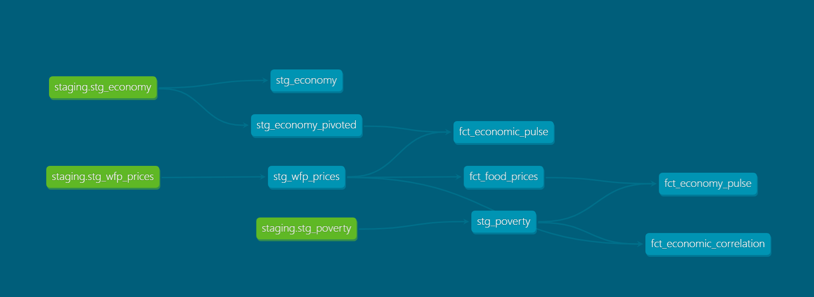
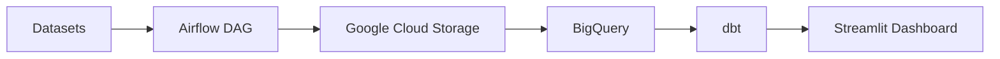

# PhilsPulse: National Economic Ingestion and Analytics Pipeline

This repository tracks delivery of the PhilsPulse capstone project.

Project framing and dataset scope are documented in [docs/project-charter.md](docs/project-charter.md).

Welcome to your new dbt project!

### Using the starter project

Try running the following commands:

- dbt run
- dbt test

### Resources:

- Learn more about dbt [in the docs](https://docs.getdbt.com/docs/introduction)
- Check out [Discourse](https://discourse.getdbt.com/) for commonly asked questions and answers
- Join the [chat](https://community.getdbt.com/) on Slack for live discussions and support
- Find [dbt events](https://events.getdbt.com) near you
- Check out [the blog](https://blog.getdbt.com/) for the latest news on dbt's development and best practices

## Partitioning and Performance

I implemented partitioning by year on the `fct_food_prices` table (partitioned by the `report_month` column) to optimize query costs in BigQuery, following best practices for large-scale analytical warehouses. This ensures efficient scans and lower costs for time-based queries.

## Architecture Diagram



## Batch Ingestion Logic

Although the data is historical, the pipeline is designed as a Batch Ingestion system. Airflow orchestrates monthly batch loads from WFP CSVs to Google Cloud Storage, then into BigQuery. dbt transforms the data for analytics, and Streamlit provides the dashboard. This design supports scalable, repeatable monthly updates as new data arrives.

## How to Run (Reproducibility)

To make reproduction turnkey the repository includes a small set of helper files:

- `requirements.txt` — Python packages for local development (dashboard + ingestion scripts)
- `airflow-requirements.txt` — optional packages intended for the Airflow container
- `ph_pulse_dbt/profiles.yml.template` — a dbt BigQuery profile template (copy to `~/.dbt/profiles.yml`)
- `.env.example` — example environment variables to copy into `.env` or export in your shell
- `Makefile` — convenience targets: `make infra`, `make up`, `make dbt-run`, `make dashboard`

Prerequisites

- Python 3.10+ and a virtualenv (optional but recommended)
- `gcloud` CLI authenticated to a service account with BigQuery & Storage roles (or use a service account JSON)
- Docker & Docker Compose (for Airflow)

Quickstart (Linux/macOS)

1. Create a Python virtual environment and install dependencies:

```bash
python -m venv .venv
source .venv/bin/activate
pip install -r requirements.txt
```

2. Provide credentials and environment variables (copy the example):

```bash
cp .env.example .env
# edit .env and set GOOGLE_APPLICATION_CREDENTIALS and GCP_PROJECT
export GOOGLE_APPLICATION_CREDENTIALS=/full/path/to/service-account.json
export GCP_PROJECT=your-gcp-project-id
export TF_VAR_project=$GCP_PROJECT
export TF_VAR_region=asia-southeast1
```

3. Set up dbt profiles

Copy the template to your dbt profiles location (default `~/.dbt`):

```bash
mkdir -p ~/.dbt
cp ph_pulse_dbt/profiles.yml.template ~/.dbt/profiles.yml
# Edit ~/.dbt/profiles.yml and confirm the values or rely on the env vars above
```

Alternatively, set `DBT_PROFILES_DIR` to point at `ph_pulse_dbt` and keep the template there.

4. Provision infrastructure (optional):

```bash
cd terraform
terraform init
terraform plan
terraform apply -auto-approve
```

5. Start services (Airflow):

```bash
docker compose up -d
# visit http://localhost:8080 to view Airflow and trigger DAGs
```

6. Run dbt (local development using seeds):

```bash
cd ph_pulse_dbt
# seed sample data for local runs and then build
dbt seed --profiles-dir $(DBT_PROFILES_DIR)
dbt build --profiles-dir $(DBT_PROFILES_DIR) --vars "use_seed: true"
```

7. Launch the Streamlit dashboard:

```bash
streamlit run app.py
```

Make shortcuts

You can use the included Makefile (if `make` is available on your system):

```bash
make infra           # terraform init/plan/apply
make up              # docker compose up -d
make dbt-run         # dbt build (uses DBT_PROFILES_DIR if set)
make dashboard       # run streamlit
```

Notes for Windows / PowerShell

- Activate the venv with:

```powershell
.\.venv\Scripts\Activate.ps1
pip install -r requirements.txt
# set environment variables using $env:NAME = 'value' or use a .env file loader
```

Airflow container

If you want packages installed into the Airflow container, you can mount or copy `airflow-requirements.txt` into the image build process or pass it to the official Airflow image during initialization. See the Airflow image docs for details.

If you want me to automatically add a simple Dockerfile or update `docker-compose.yaml` to install `airflow-requirements.txt` inside the Airflow service, tell me and I'll add that change.

## Security / Credentials

- This repository previously contained a service account JSON at `config/google_credentials.json`. That file has been removed from the repository and replaced with a safe example: `config/google_credentials.json.example`.
- DO NOT commit real service-account JSON files. Keep `config/google_credentials.json` listed in `.gitignore` (already configured).
- After you deploy or rotate keys, create `config/google_credentials.json` locally (not committed) and point `GOOGLE_APPLICATION_CREDENTIALS` to it, or mount it into containers when running locally.
- To remove sensitive files from Git history use a history rewrite tool such as `git filter-repo`. Example commands:

```bash
# remove the file from the current index and commit
git rm --cached config/google_credentials.json || true
git commit -m "chore(security): remove committed service account key"

# rewrite history (run only if you understand the implications)
# pip install git-filter-repo
# git filter-repo --path config/google_credentials.json --invert-paths
```

After rewriting history you should rotate any exposed credentials immediately. If you want, I can attempt a safe history scrub for you (it will rewrite commits and require a force-push).
