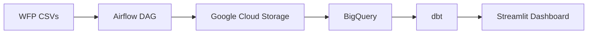

Welcome to your new dbt project!

### Using the starter project

Try running the following commands:

- dbt run
- dbt test

### Resources:

- Learn more about dbt [in the docs](https://docs.getdbt.com/docs/introduction)
- Check out [Discourse](https://discourse.getdbt.com/) for commonly asked questions and answers
- Join the [chat](https://community.getdbt.com/) on Slack for live discussions and support
- Find [dbt events](https://events.getdbt.com) near you
- Check out [the blog](https://blog.getdbt.com/) for the latest news on dbt's development and best practices

## Partitioning and Performance

I implemented partitioning by year on the `fct_food_prices` table (partitioned by the `report_month` column) to optimize query costs in BigQuery, following best practices for large-scale analytical warehouses. This ensures efficient scans and lower costs for time-based queries.

## Architecture Diagram



## Batch Ingestion Logic

Although the data is historical, the pipeline is designed as a Batch Ingestion system. Airflow orchestrates monthly batch loads from WFP CSVs to Google Cloud Storage, then into BigQuery. dbt transforms the data for analytics, and Streamlit provides the dashboard. This design supports scalable, repeatable monthly updates as new data arrives.

## How to Run (Reproducibility)

This dbt project is configured to run against BigQuery. For local reproducibility we include a `profiles.yml` template and a short checklist.

1. Install dbt and project dependencies (see top-level `requirements.txt`):

```bash
python -m venv .venv
source .venv/bin/activate
pip install -r ../requirements.txt
pip install dbt-bigquery==1.11.1
```

2. Create your dbt profile

Copy the provided template into your dbt profiles location (default `~/.dbt`):

```bash
mkdir -p ~/.dbt
cp profiles.yml.template ~/.dbt/profiles.yml
# Edit ~/.dbt/profiles.yml to confirm values, or rely on the env vars listed in .env.example
```

The template uses environment variables: set `GCP_PROJECT`, `GOOGLE_APPLICATION_CREDENTIALS`, and optionally `DBT_DATASET` or `GCP_REGION`.

3. Optional: use local seeds for offline work

```bash
cd ph_pulse_dbt
dbt seed --profiles-dir $(DBT_PROFILES_DIR)
dbt build --profiles-dir $(DBT_PROFILES_DIR) --vars "use_seed: true"
```

4. Production run (against your live BigQuery dataset)

```bash
cd ph_pulse_dbt
dbt build --profiles-dir $(DBT_PROFILES_DIR)
```

If you prefer not to copy `profiles.yml` to `~/.dbt`, set the `DBT_PROFILES_DIR` environment variable to point to this folder and dbt will use that profiles file.

If you need help creating a service account for dbt with the minimum BigQuery permissions, I can add example IAM roles and a short walkthrough.
